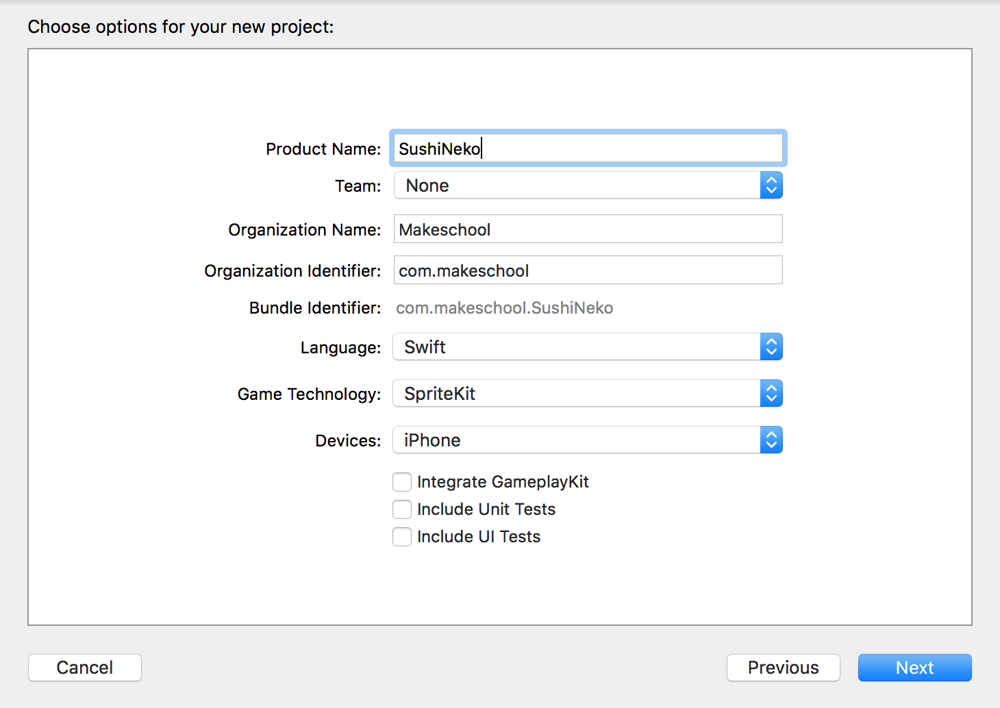
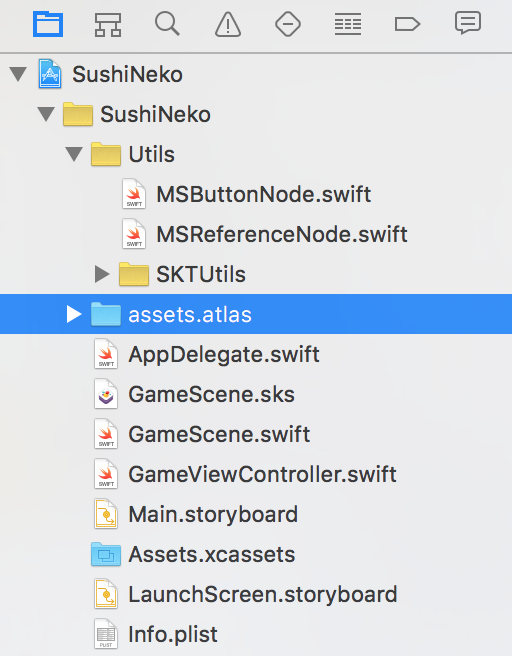

#Create a new SpriteKit project

> [action]
> Create a new *Game* project in Xcode named `SushiNeko` and check the *Language* is set to `Swift` and
> *Game Technology* is set to `SpriteKit`.
> 
>
> 

##Importing Resources

> [action]
> Download the [Sushi Neko Art Pack](https://github.com/MakeSchool-Tutorials/Sushi-Neko-SpriteKit-Swift/raw/master/assets.atlas.zip) we created for you.
> Once the download is complete, unpack the folder and add it to your project.
> Ensure you have *Copy items if needed* and *Create groups*.
> 
>

<!-- -->

> [action]
> Download the [SFX Starter Kit](https://github.com/MakeSchool-Tutorials/Sushi-Neko-SpriteKit-Swift/raw/master/SFX.zip) we made for you. Once the download is complete, unpack the folder and add to the project.
> Ensure you have *Copy items if needed* and *Create groups*.
> 
>

##Adding extra functionality

SpriteKit is missing some useful functionality, thankfully we have bundled some together for you.  

> [action]
> Download the [MakeSchool Utilities](https://github.com/MakeSchool-Tutorials/Sushi-Neko-SpriteKit-Swift/raw/master/Utils.zip), unpack the folder and add it to your project as you did with the art pack.
>
> Your project structure should hopefully look similar to this:
>

#Summary

Great, you now have everything in place to get started building your game.
